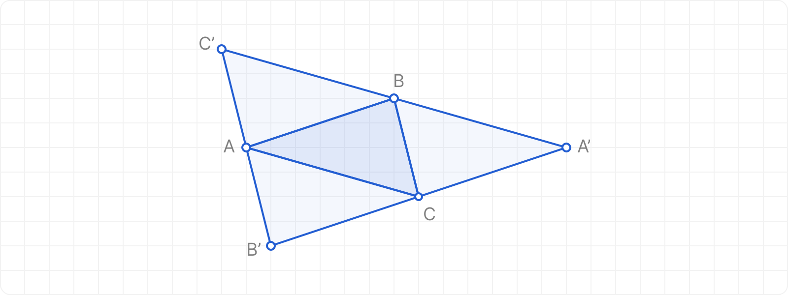

# Parallelograms Finder

## Description

Given three points in a 2D plane, the task is to find three possible fourth points to form a parallelogram and determine the type of the resulting shape (parallelogram, rectangle, rhombus, or square). The program must handle invalid inputs and detect cases where the input points lie on a straight line, making a parallelogram impossible.



## Input and Output

- **Input:** Three points A, B, and C with coordinates as pairs of decimal numbers enclosed in square brackets.
- **Output:** Coordinates of the three possible fourth points and the type of parallelogram.

### Input Validation

- Non-numeric coordinates
- Missing coordinates
- Incorrect format (missing or extra delimiters)

### Output Types

- Parallelogram (General case)
- Rhombus
- Rectangle
- Square

### Error Handling

- Points lying on a straight line (no parallelogram possible)
- Invalid input formats

## Example Runs

### Valid Inputs

```txt
Bod A:
> [0, 0]
Bod B:
> [7, 0]
Bod C:
> [3, 2]
A': [10,2], rovnobeznik
B': [-4,2], rovnobeznik
C': [4,-2], rovnobeznik
```

```txt
Bod A:
> [0,0]
Bod B:
>  [  5  ,  0     ]
Bod C:
>
>
>
> [3,
> 4
> ]
A': [8,4], kosoctverec
B': [-2,4], rovnobeznik
C': [2,-4], rovnobeznik
```

```txt
Bod A:
> [10.5, 10.5]   [12.5, 10.5][10.5, 15e+0]
Bod B:
Bod C:
A': [12.5,15], obdelnik
B': [8.5,15], rovnobeznik
C': [12.5,6], rovnobeznik
```

### Invalid Inputs

```txt
Bod A:
> [-306.710, -894.018]
Bod B:
> [6369.015, 66159.129]
Bod C:
> [6016.590, 62619.258]
Rovnobezniky nelze sestrojit.
```

```txt
Bod A:
> [2, 5]
Bod B:
> [3, 4]
Bod C:
> [7 9]
Nespravny vstup.
```

### Notes

- Use `double` for decimal numbers to ensure precision.
- Ensure the output has the correct formatting, including spaces and newline characters.
