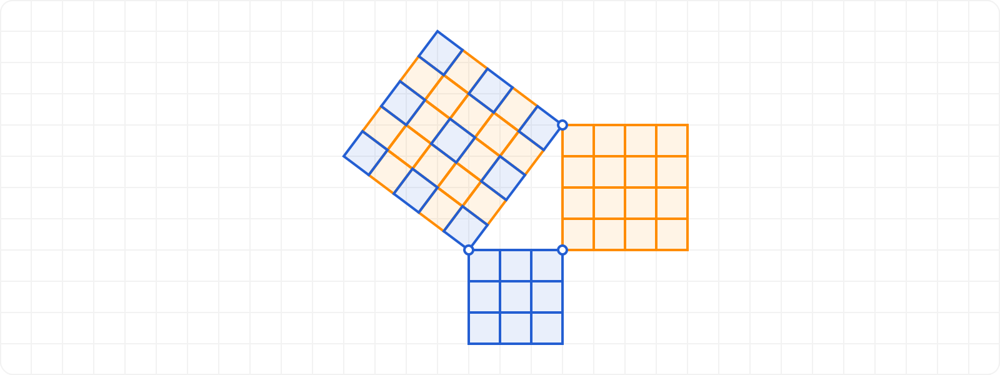

# Right Triangle Finder

## Description

The task is to create a program that identifies and counts all unique right triangles with integer side lengths within a specified closed interval of integers <a;b>. For example, for the interval <4;14>, the valid triangles are:

- 5, 12, 13
- 6, 8, 10

Triangles like 3, 4, 5 and 9, 12, 15 are excluded because their sides fall outside the given interval.

Only unique shapes are considered; for instance, the triangles 5, 12, 13 and 6, 8, 10 are counted separately, but the permutations of 5, 12, 13 (like 12, 5, 13) are treated as identical.



## Input and Output

- **Input:** Queries defined by `? <lo;hi>` for listing triangles or `# <lo;hi>` for counting triangles, where `lo` and `hi` are integers specifying the interval.
- **Output:** Lists of triangle sides or counts, formatted as specified.

### Input Validation

- Unrecognized query type (not starting with `?` or `#`)
- Incorrect interval format (must be positive integers, lower bound must be less than or equal to upper bound)
- Missing delimiters (less than, greater than, semicolon)

### Output Types

- List of unique right triangles with integer sides
- Count of unique right triangles

### Error Handling

- Invalid input formats
- Non-positive integers in the interval

## Example Runs

### Valid Inputs

```txt
Problemy:
> ? <10;30>
* 10 24 26
* 12 16 20
* 15 20 25
* 18 24 30
* 20 21 29
Celkem: 5
> ? <8;60>
* 8 15 17
* 9 12 15
* 9 40 41
* 10 24 26
* 12 16 20
* 12 35 37
* 14 48 50
* 15 20 25
* 15 36 39
* 16 30 34
* 18 24 30
* 20 21 29
* 20 48 52
* 21 28 35
* 24 32 40
* 24 45 51
* 27 36 45
* 28 45 53
* 30 40 50
* 33 44 55
* 36 48 60
* 40 42 58
Celkem: 22
> # <8;60>
Celkem: 22
> # <7;120>
Celkem: 63
```

### Invalid Inputs

```txt
Problemy:
> * <3;9>
Nespravny vstup.
```

```txt
Problemy:
> # <12;11>
Nespravny vstup.
```

```txt
Problemy:
> ? 10;20
Nespravny vstup.
```

## Notes

- Ensure to maintain the exact output format, including spaces and newlines.
- Handle errors immediately after reading input.
