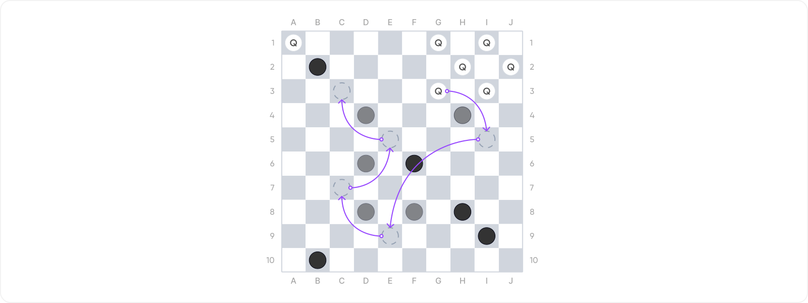

# Checkers Moves Calculator

## Description

The task is to create a program that calculates possible moves of pieces in the game of checkers.

We assume a standard checkers game with standard rules. However, we consider a square playing board of up to 26 x 26 squares. We consider both regular pieces and kings. The input to the program is the size of the board and the placement of the pieces. The program's task is to determine the possible moves for the white pieces, including all valid moves and the number of captured black pieces.



## Input and Output

### Input

The program's input is first the size of the playing board (an integer, maximum 26). Then follows a list of pieces. Each piece is specified on one line with the following format:

`type column row`

where type represents the piece type (`w` - white piece, `W` - white king, `b` - black piece, `B` - black king), column is a lowercase letter (a, b, ...), and row is an integer (1, 2, ...). The input ends upon reaching EOF.

### Output

The program's output is a list of possible moves. The format of the moves is clear from the example, with the number of captured black pieces indicated after the sequence of squares (if any black piece is captured). The last line of the output specifies the total number of different moves.

### Input Validation

If the input is invalid, the program must detect this and display an error message. Display error messages on standard output (not on standard error). Consider the following as errors:

- The size of the playing board is non-numeric or outside the interval 3 to 26.
- The column or row position of a piece is outside the playing board.
- The piece type is not `w`, `W`, `b`, or `B`.
- The coordinates do not correspond to a dark square (a1 is dark).
- More than one piece is specified on a single square.

## Moves Rules

- Regular white pieces always move diagonally one position towards a higher row number. The destination square must be free.
- If a regular white piece captures an opponent's piece, it moves diagonally two positions towards a higher row number. The captured black piece must be one position diagonally in the direction of the jump, and the destination square must be free. Captures can be chained, changing direction left/right, but always moving towards a higher row number.
- Kings can move diagonally in any direction for any number of free squares.
- Kings can capture an opponent's piece diagonally in any direction. They can jump over any number of empty squares, exactly one opponent's piece, and then any number of free squares. After completing a jump, kings can chain further jumps with the same rules, changing direction, but not making a 180-degree turn.
- Captured pieces are immediately removed from the board, so subsequent chained jumps see the squares as free.

## Example Runs

```txt
Velikost hraci plochy:
> 10
Pozice kamenu:
> w b4
> w d4
> w f4
> b a5
> b c5
> B e5
> b f6
> w e3
> w h4
b4 -> d6 +1
d4 -> b6 +1
f4 -> g5
f4 -> d6 +1
h4 -> i5
h4 -> g5
Celkem ruznych tahu: 6
```

```txt
Velikost hraci plochy:
> 10
Pozice kamenu:
> w a1
> w g1
> w i1
> w h2
> w j2
> w g3
> w i3
> b b2
> b d4
> b h4
> b d6
> B f6
> b d8
> b f8
> b h8
> b i9
> b b10
a1 -> c3 +1
a1 -> c3 -> e5 +2
a1 -> c3 -> e5 -> g7 +3
a1 -> c3 -> e5 -> g7 -> e9 +4
a1 -> c3 -> e5 -> c7 +3
a1 -> c3 -> e5 -> c7 -> e9 +4
g1 -> f2
g3 -> i5 +1
g3 -> f4
i3 -> j4
i3 -> g5 +1
Celkem ruznych tahu: 14
```

```txt
Velikost hraci plochy:
> 10
Pozice kamenu:
> W a1
> W g1
> W i1
> W h2
> W j2
> W g3
> W i3
> b b2
> b d4
> b h4
> b d6
> B f6
> b d8
> b f8
> b h8
> b i9
> b b10
a1 -> c3 +1
a1 -> c3 -> e5 +2
a1 -> c3 -> e5 -> c7 +3
a1 -> c3 -> e5 -> c7 -> e9 +4
a1 -> c3 -> e5 -> c7 -> e9 -> g7 +5
g1 -> f2
g1 -> e3
g1 -> c5 +1
Celkem ruznych tahu: 141
```

```txt
Velikost hraci plochy:
> 10
Pozice kamenu:
> w a2
Nespravny vstup.
```

```txt
Velikost hraci plochy:
> 27
Nespravny vstup.
```
